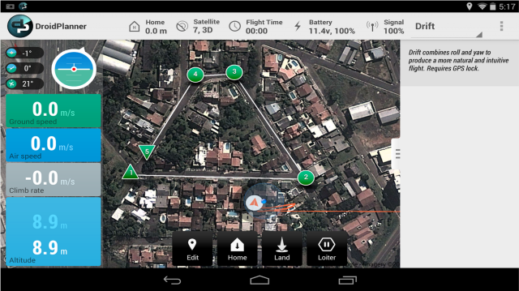

# Choosing a Ground Station

There are at least seven different ground stations (Mission Planner, APM Planner2, MAVProxy, Droid Planner, AndroPilot, MAVPilot and QGroundControl) that can be used to communicate with ArduPilot (i.e. ArduCopter, ArduPlane, ArduRover, AntennaTracker).  This page gives a high-level overview of them and provides links so you can make the appropriate choice.

#### [Mission Planner](http://planner.ardupilot.com/)

[Source code](https://github.com/diydrones/MissionPlanner)

#### [APM Planner 2](http://dev.ardupilot.com/)

You can find more information in the [dedicated section](http://erlerobotics.gitbooks.io/erle-robotics-erle-brain-a-linux-brain-for-drones/content/en/GCS/apmplanner.html) of the [Erle-Brain](http://erlerobotics.gitbooks.io/erle-robotics-erle-brain-a-linux-brain-for-drones/) book.

[Source code](https://github.com/diydrones/apm_planner)

#### [MAVProxy](http://tridge.github.io/MAVProxy/)

MAVProxy is a fully-functioning GCS for UAV's. The intent is for a minimalist, portable and extendable GCS for any UAV supporting the MAVLink protocol (such as the APM).

[Source code](https://github.com/tridge/MAVProxy)

#### [DroidPlanner](https://play.google.com/store/apps/details?id=org.droidplanner&hl=es)

Droidplanner is a Ground Control Station (GCS) Android app for UAVs running Ardupilot software.

[Source code](https://github.com/DroidPlanner/droidplanner)

#### [AndroPilot](https://github.com/geeksville/arduleader/wiki)

[Source code](https://github.com/geeksville/arduleader/tree/master/andropilot)

#### [MAVPilot for iPhone](https://itunes.apple.com/app/mav-pilot/id649233096)

This is a "Ground Control Station for your Pocket". Its target audience is iPhone users (iPad version will come later). Pilots often fly unaccompanied and this can make it difficult to use a laptop at the same time. This is more so when a pilot is using a semi-auto modes like Alt-Hold etc... Using your iPhone instead of a laptop is a great way to keep focused on the MAV and still have all the useful information in reach. With in built text-to-speech support your iPhone will let you know instantly the status of your MAV as you are flying

[Wiki](http://diydrones.com/profiles/blogs/mav-pilot-v1-0-for-iphone-is-available-in-the-app-store)

#### [QGroundControl](http://www.qgroundcontrol.org/)
[QGroundControl](http://www.qgroundcontrol.org/) is based on PIXHAWK's Groundstation and is now developed in a joint effort with the community.

QGroundControl's main interface protocol is **MAVLink**, a binary, serial stream protocol which QGroundControl can receive over UDP or serial links (radio modems). The full protocol documentation is available at: [MAVLink Micro Air Vehicle Communication Protocol](http://www.qgroundcontrol.org/mavlink/start).

[Source code]()
