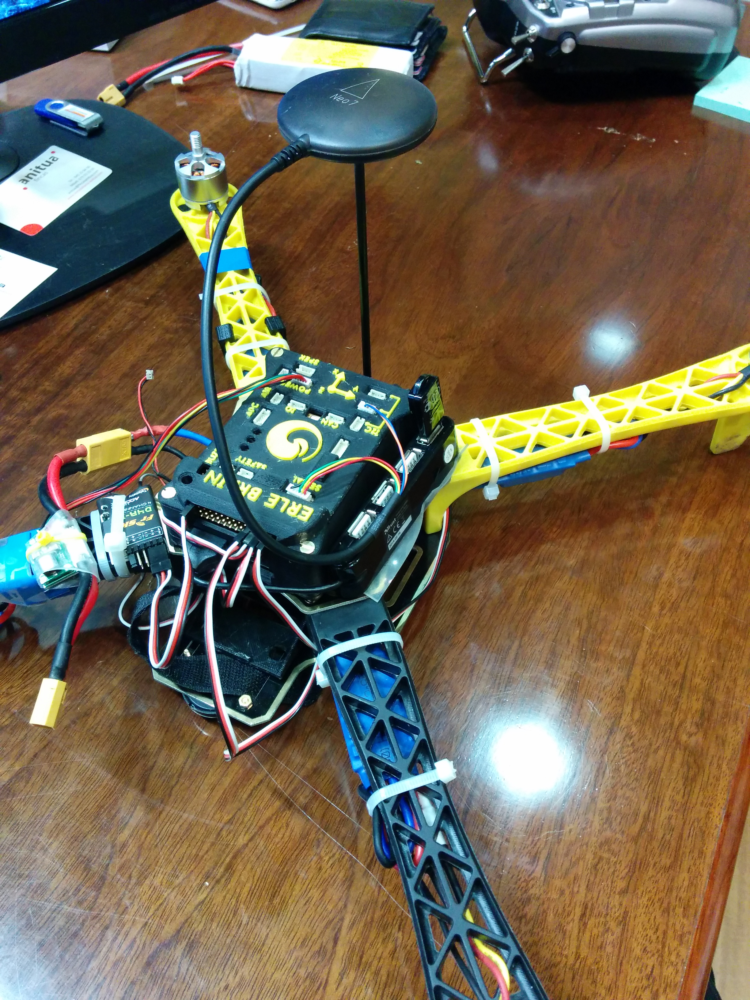

# GPS

The Global Positioning System (GPS) is a space-based satellite navigation system that provides location and time information outdors in all weather conditions, anywhere on or near the Earth where there is an unobstructed line of sight to four or more GPS satellites.

At Erle Robotics we generally use a design that incorporates both a GPS uBlox Neo-7M and the HMC5883L digital compass. This kit also includes a molded case and pedestal mount which provides a convenient way of mounting the module high and away from possible sources of interference.

This GPS module significantly outperforms the Mediatek GPS due to the larger antenna and next-gen chipset. An excellent solution for multicopters and rovers in particular, where GPS accuracy is paramount. It features active circuitry for the ceramic patch antenna, rechargeable backup battery for warm starts, and I2C EEPROM for configuration storage.

This GPS module can be purchased in the [Erle Robotics store](https://erlerobotics.com/blog/product/erle-gps-erle-ublox-gps-compass-kit/).

-----

We would recommend you to separate the GPS from the autopilot using a stick or something similar. Our experience in practical scenarios has shown that the GPS signal is way better when doing so.

