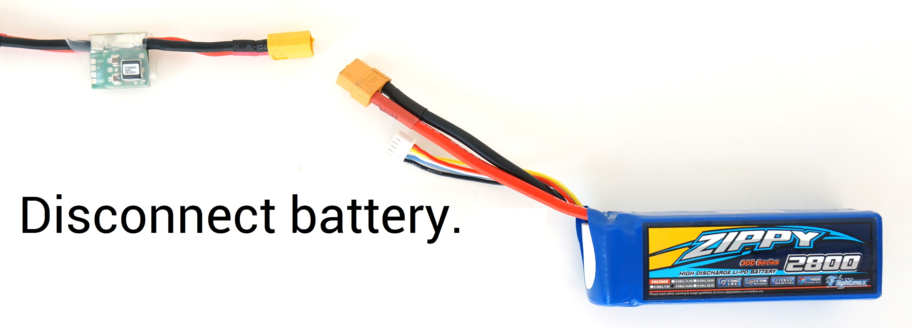

# ESC calibracion

http://copter.ardupilot.com/wiki/initial-setup/esc-motor/

Electronic speed controllers are responsible for spinning the motors at the speed requested by the autopilot. Most ESCs need to be calibrated so that they know the minimum and maximum pwm values that the flight controller will send.  This page provides instructions for calibrating ESCs.

#### All at once calibration

######Safety Check!

Before calibrating ESCs, please ensure that your copter has NO PROPS on it and that the APM is NOT CONNECTED to your computer via USB and the Lipo battery is disconnected.

- Turn on your transmitter and put the throttle stick at maximum.

- Connect the Lipo battery.  The autopilot’s red, blue and yellow LEDs will light up in a cyclical pattern. This means the it’s ready to go into ESC calibration mode the next time you plug it in.

- With the transmitter throttle stick still high, disconnect and reconnect the battery.

- The autopilot is now in ESC calibration mode. (On an APM you may notice the red and blue LEDs blinking alternatively on and off like a police car).

- Wait for your ESCs to emit the musical tone, the regular number of beeps indicating your battery’s cell count (i.e. 3 for 3S, 4 for 4S) and then an additional two beeps to indicate that the maximum throttle has been captured.

- Pull the transmitter’s throttle stick down to its minimum position.

- The ESCs should then emit a long tone indicating that the minimum throttle has been captured and the calibration is complete.

- If the long tone indicating successful calibration was heard, the ESCs are “live” now and if you raise the throttle a bit they should spin. Test that the motors spin by raising the throttle a bit and then lowering it again.

- Set the throttle to minimum and disconnect the battery to exit ESC-calibration mode.
