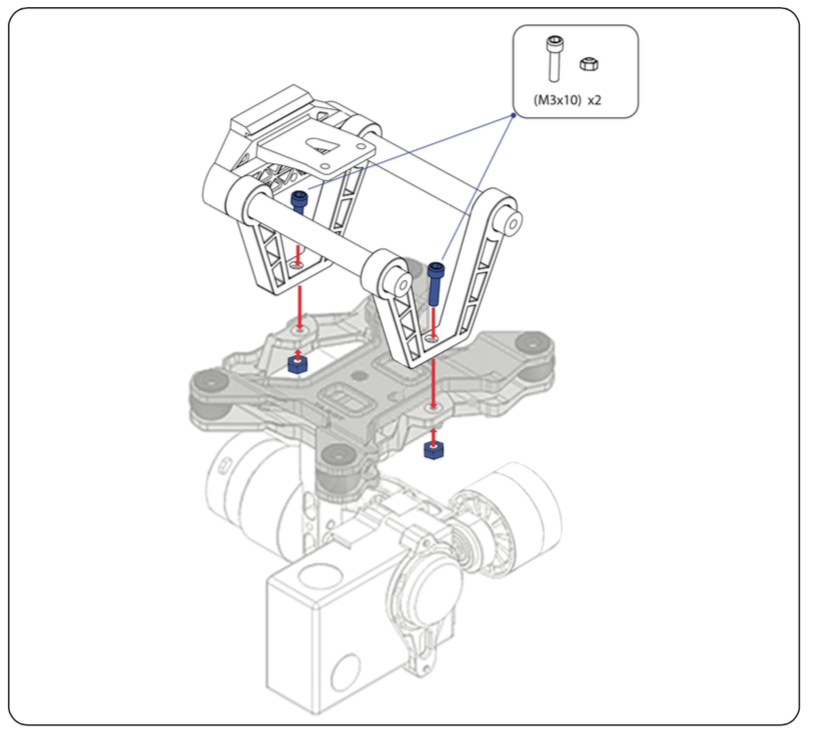
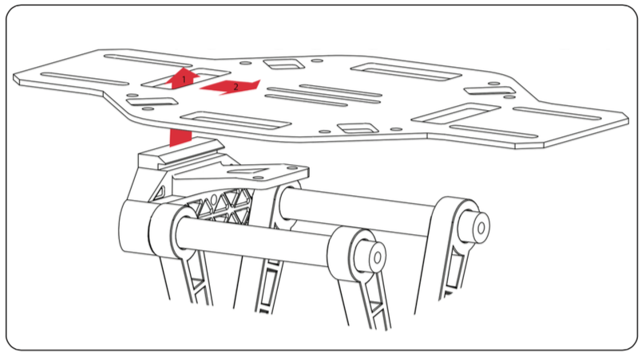
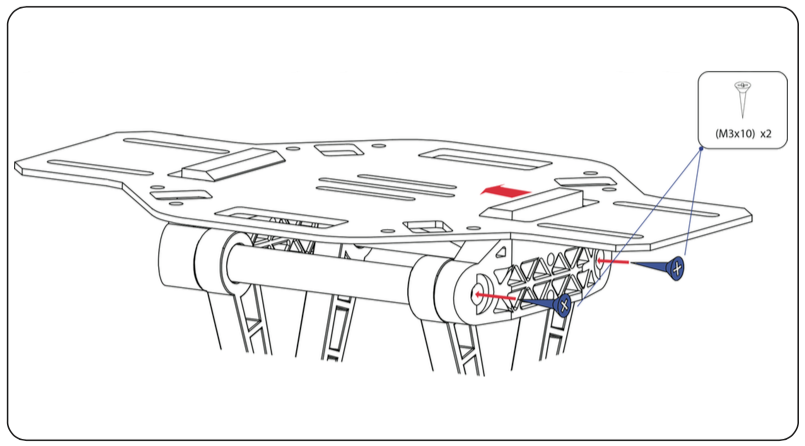

#Gimbal in Erle-Copter

[Erle-Robotics](http://erlerobotics.com/blog/home-creative/) provides a mechanical solution to integrate differente gimbals in [Erle-Copter](http://erlerobotics.com/blog/erle-copter/).

The next image shows the system to hitch the gimbal to Erle-Copter frame:

##Setup Instructions

If you have purchased an Erle-Copter with gimbal, follow the next steps to setup correctly the gimbal + camera:

+ Screw the gimbal to the structure

+ Hook up the structure to the frame

+ Finally, tighten the two remaining screws of the system

