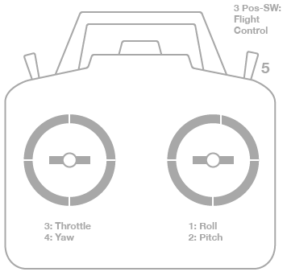

# Radio Calibration

http://copter.ardupilot.com/wiki/initial-setup/configuring-hardware/#Calibrate_radio_control

Turn on transmitter. Verify that the transmitter is in vehicle and all trims are centered.

#### Modes
- **Mode 1**: the left stick will control pitch and yaw, the right stick will control throttle and roll.
- **Mode 2**: the left stick will control throttle and yaw; the right stick will control pitch and roll.

For either type of transmitter, the transmitter’s three-position switch should be attached to **channel 5 and will control flight modes**.

Optionally the transmitter’s tuning knob should control channel 6 for inflight tuning.  Channel 7 and Channel 8 switches can be used for controlling auxiliary functions. For example to control the gimbal.

Move the control sticks and toggle switches on your transmitter to their limits of travel. Your transmitter should cause the following control changes:
- **Channel 1**: low = roll left, high = roll right.
- **Channel 2**: low = pitch forward, high=pitch back.
- **Channel 3**: low = throttle down (off), high = throttle up.
- **Channel 4**: low = yaw left, high = yaw right.

Check [Erle-Brain's book](http://erlerobotics.gitbooks.io/erle-robotics-erle-brain-a-linux-brain-for-drones/content/en/GCS/apmplanner.html#radio-calibration) for more information.