#PreFlight Checks

Before flying [Erle-Plane](http://erlerobotics.com/blog/erle-plane/) for the fist time, you have to be sure all is working as expected. 

---
[This video](https://www.youtube.com/watch?v=gqvfsJAXNZE&feature=youtu.be), explains the proccess

----

In order to do so, follow the next steps:

###Manual Mode Checks

The `Manual Mode Checks` allows you to see that the RC Channels are setup properly, the autopilot does not interfere between the RC and the values that are written to the servos and the motor.

----
*For more info, check [flight modes section](../flight_modes/README.md)*

----

With this verification we could see if the four channel are assigned properly to the `RC sticks` and are not reversed. Follow the next steps:

+ Power up Erle-Plane
+ Connect to [Erle-Plane](http://erlerobotics.com/blog/erle-plane/) and set it into `Manual Mode`.
+ Trigger the throttle from the `RC`, as in the image below:

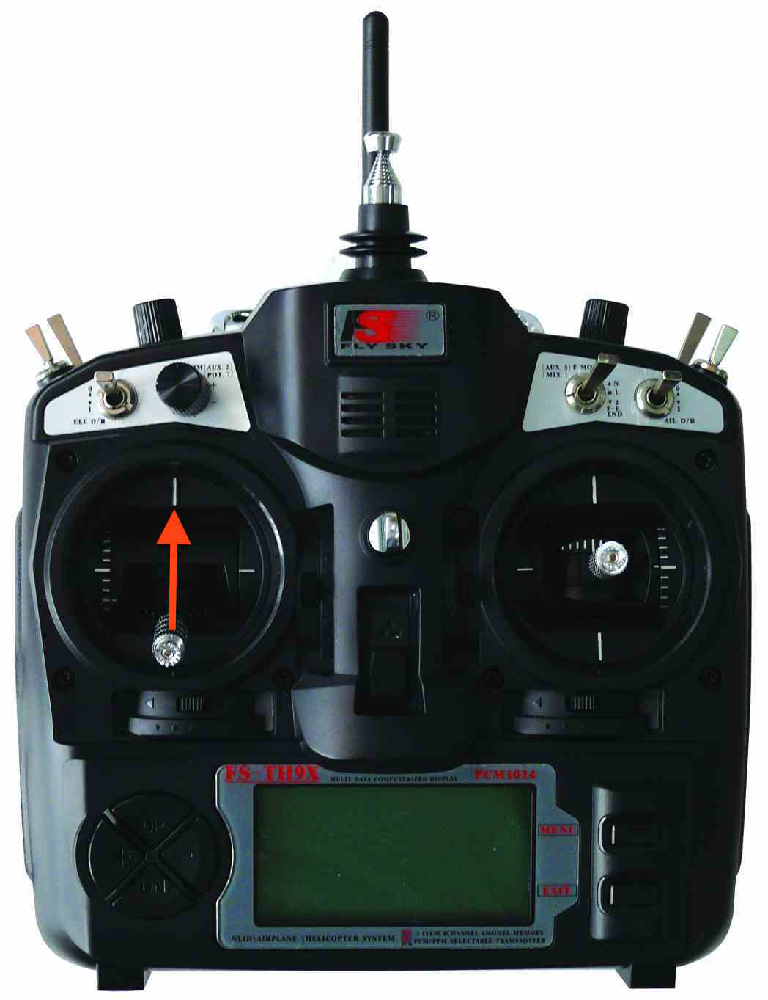

-----

+ Check the `Rudder` is working fine

Turn the left stick to the right, you should see that the `rudder` flap turns also to the right

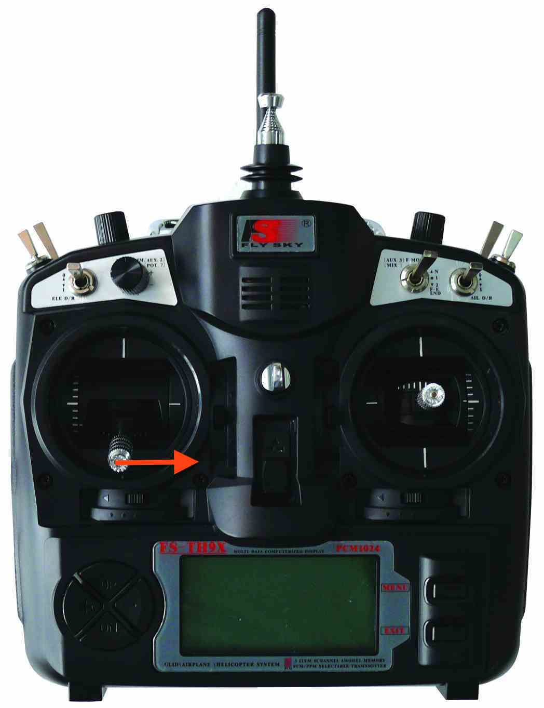

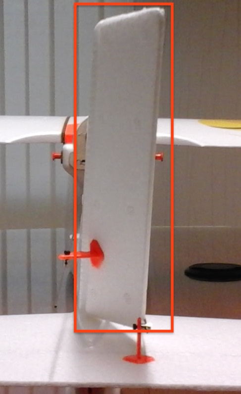

And now turn the left stick to the left and check if `rudder` also moves to the left:

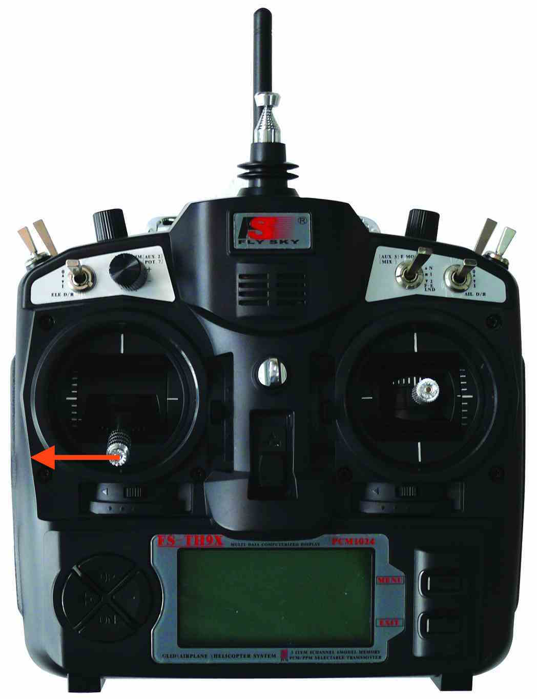

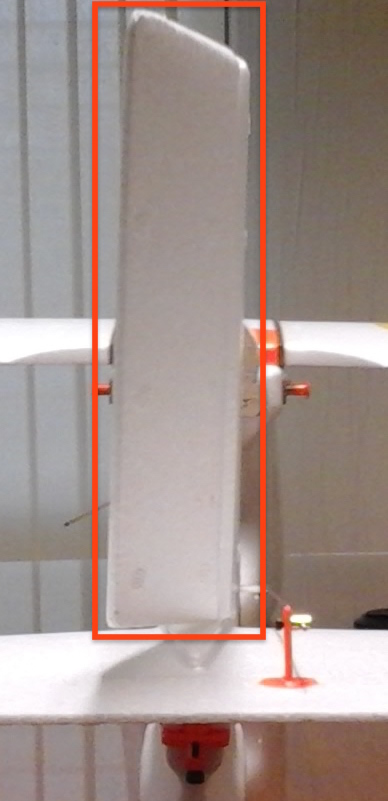

-----

+ Check that the `ailerons` are working fine

Move the right stick of the RC to the right
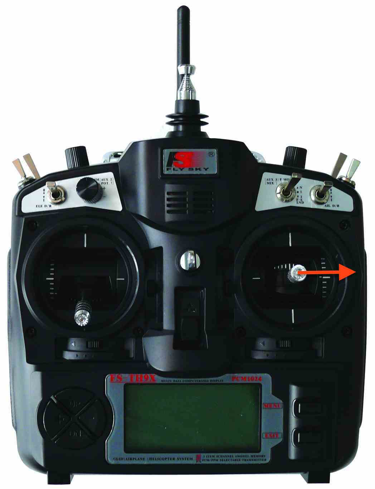

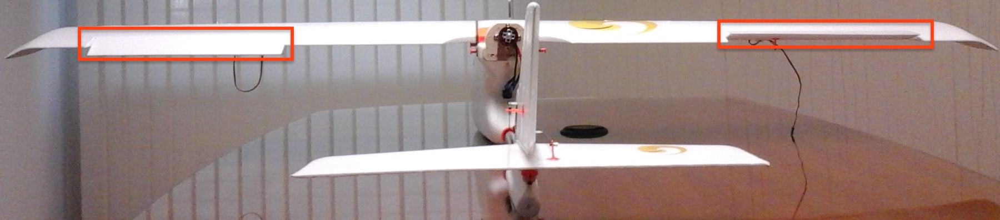

You should see how the `left aileron` moves down and the `right aileron` up.

Move the right stick of the RC to the left
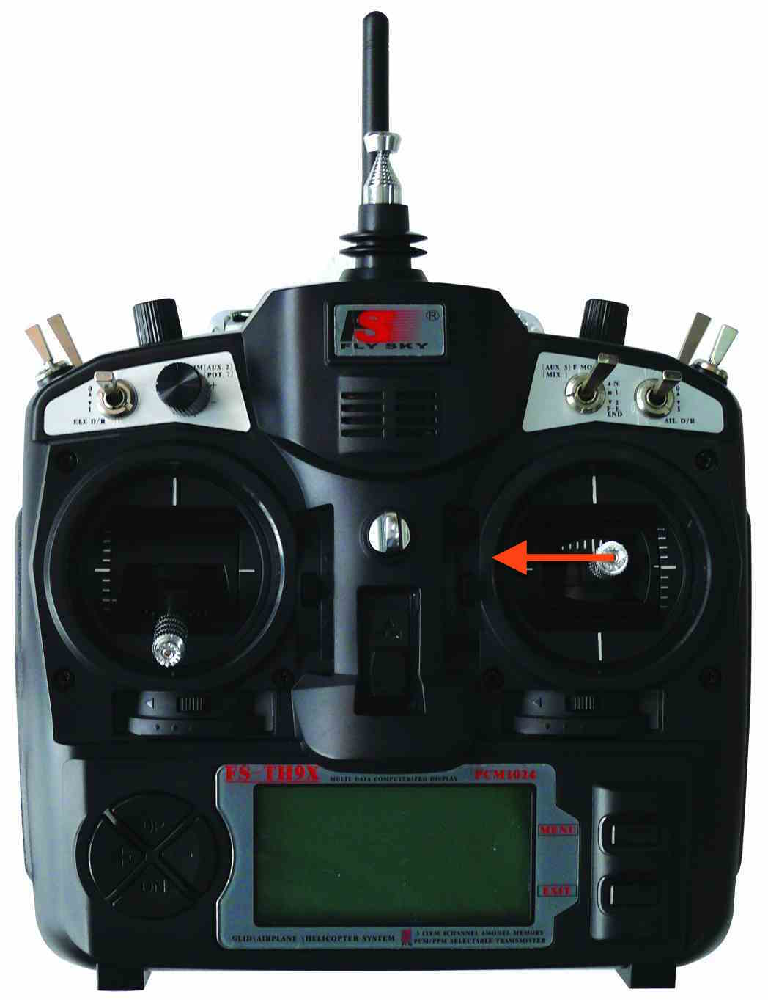

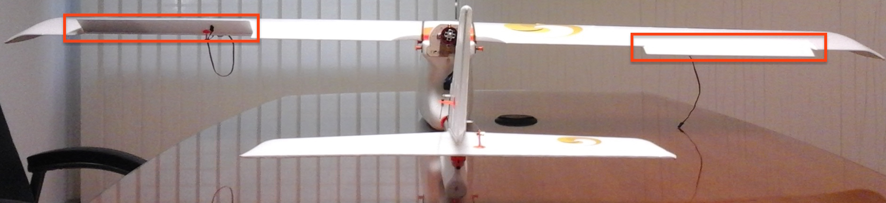

You should see how the `left aileron` moves up and the `right aileron` down.

----

+ Check the `Elevator` is working fine

Turn the right stick to the up, you should see that the `elevator` flap turns down

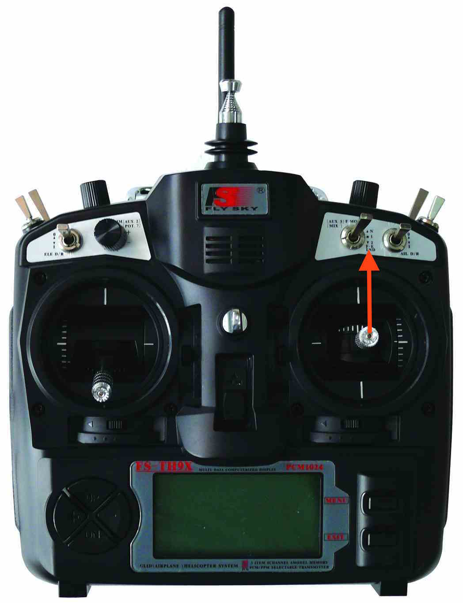

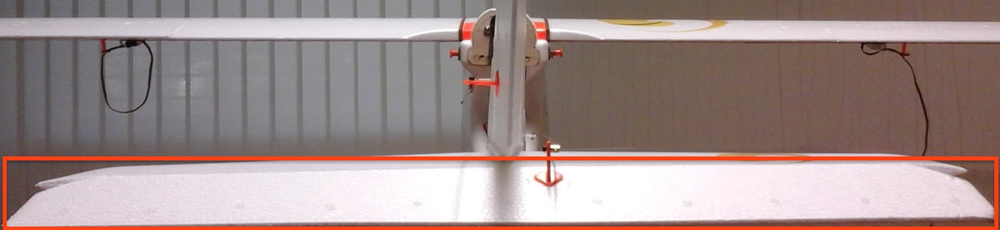

And now turn the right stick down and check if `elevator` moves up:

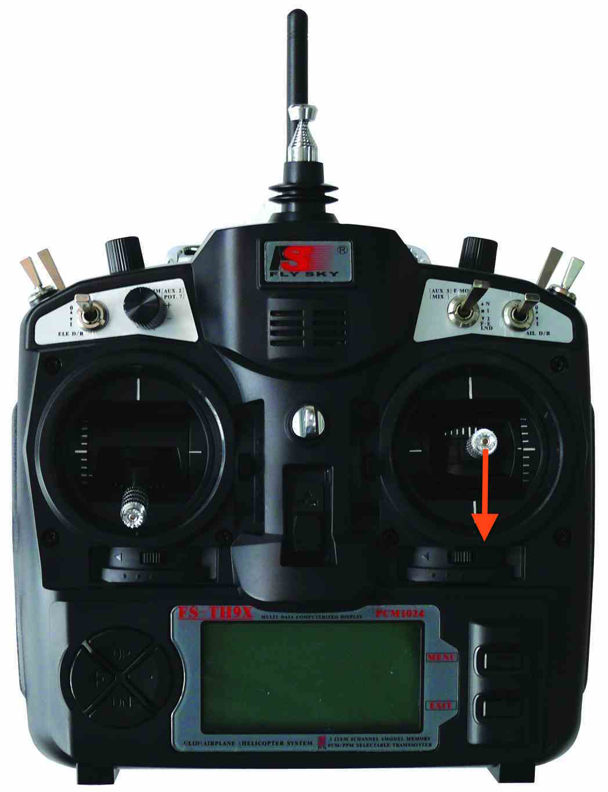

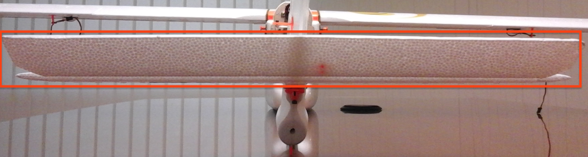

----

###Troubleshooting

You might find that your [Erle-Plane](http://erlerobotics.com/blog/erle-plane/) is not behaving as described above. So, what to do??

+ RC Sticks are not set in the same order as explained above

That means that `autopilot` have assigned the received channels as in a different order. To fix this behaviour change `RC Map` parameters: change the channel number (1-4) where autopilot is receiving the rudder,yaw,pitch and roll. Save the changes.

+ The movements are reversed

This means that the RC is sending the values wrongly. To fix this behaviour: in the RC, enter in `settings` -> `Reverse`. Reverse the channel you want.

------

###Stabilize Mode Checks

Once we are sure that [Erle-Plane](http://erlerobotics.com/blog/erle-plane/) and the RC are properly configured, let's see if the autopilot corrects the state of the plane correctly.

+ Set [Erle-Plane](http://erlerobotics.com/blog/erle-plane/) to `stabilize mode`.
+ Roll [Erle-Plane](http://erlerobotics.com/blog/erle-plane/) to the right.

You should see that the `left aileron`moves up and the `right aileron`down. You also should see that the `rudder` moves to the left.

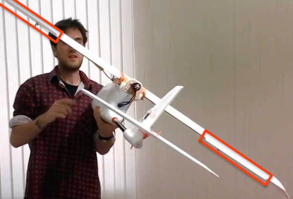

---

+ Roll [Erle-Plane](http://erlerobotics.com/blog/erle-plane/) to the left

You should see that the `left aileron`moves down and the `right aileron`up. You also should see that the `rudder` moves to the right.

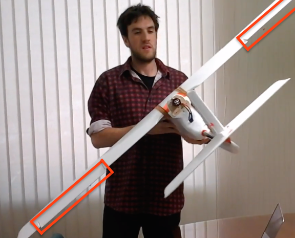
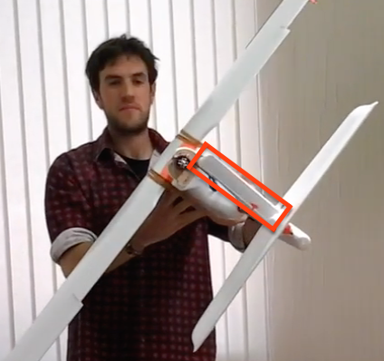

---

+ Put the nose of [Erle-Plane](http://erlerobotics.com/blog/erle-plane/) looking to the floor.

You should see that the `elevator`moves up.

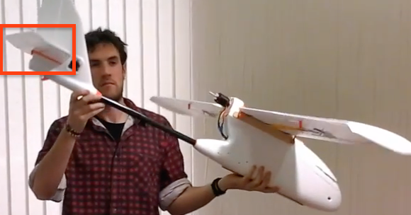

----

+ Put the nose of [Erle-Plane](http://erlerobotics.com/blog/erle-plane/) looking to the roof.

You should see that the `elevator`moves down.

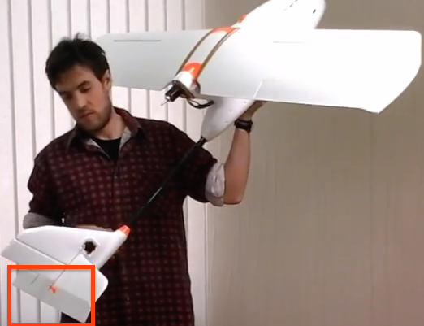

###Troubleshooting

You might find that your [Erle-Plane](http://erlerobotics.com/blog/erle-plane/) is not behaving us described above. So what to do if the movements are reversed??

Open the parameters list, the easiest way to do it, is to open a GCS. Now, change the reverse/direct parameter of the channel that is moving wrong. If it is set to '1', assign it to '-1', and vice versa.