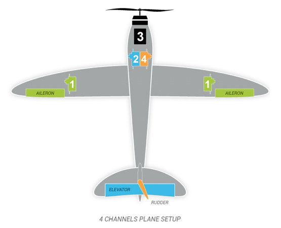
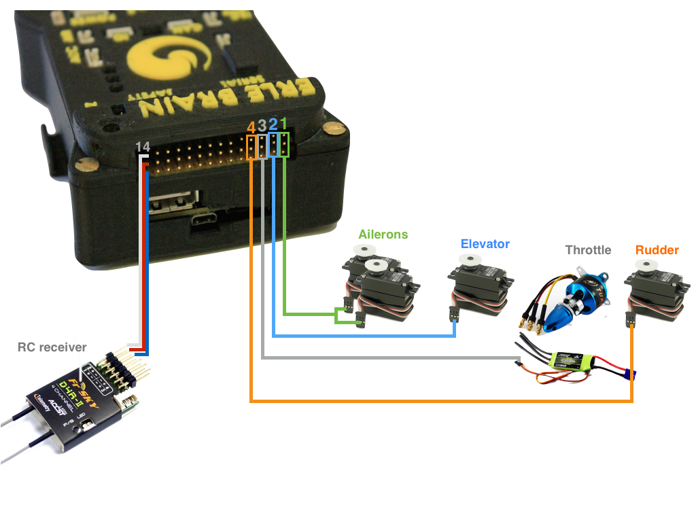
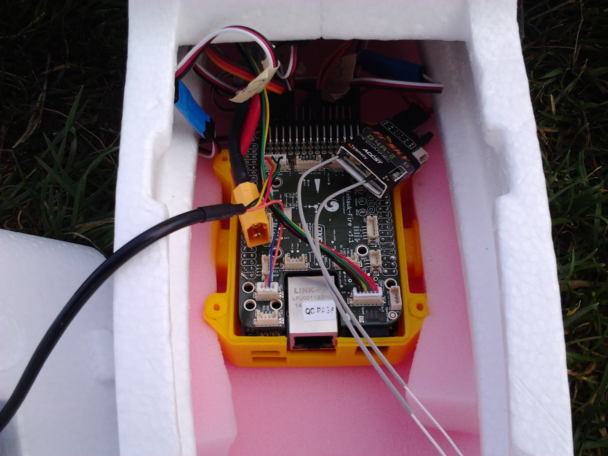
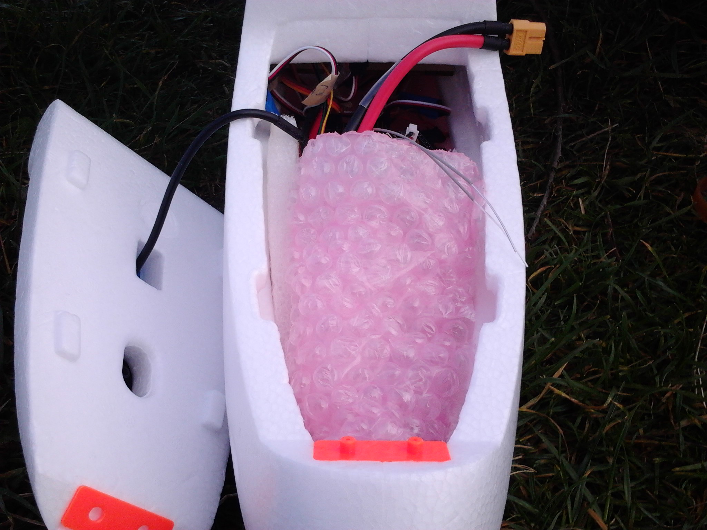

#Erle-Plane Setup

In this section hardware connections will be explained. The image below, shows the most common hardware attached to Erle-Brain:

##Typical Hardware Setup

----
If you desire general info about [Erle-Brain](https://erlerobotics.com/blog/erle-brain/) hardware, please visit its [book](http://erlerobotics.gitbooks.io/erle-robotics-erle-brain-a-linux-brain-for-drones/content/en/hardware/erle-brain.html)

-----

#Plane hardware

The plane needs some basic motors and servos in order to command it properly: One motor, two servos to command the ailerons, another servo for the rudder and a last servo for the elevator. This components are commanded using four PWM channels. In Erle-Plane you must connect:

+ **Channel 1**: Alierons.
+ **Channel 2**: Elevator.
+ **Channel 3**: Throttle.
+ **Channel 4**: Rudder.

Just connect this elements properly, schematically is in the next way:

Once you have mounted and connected [Erle-Brain](https://erlerobotics.com/blog/erle-brain/) in the compartment that the plane has, make sure that is fixed properly. Right now, at [Erle-Robotics](https://erlerobotics.com) we are working in a system that tightens [Erle-Brain](https://erlerobotics.com/blog/erle-brain/) to the plane.
We have flight the plane using fluffy material. Check the next image in order to figure out how:

