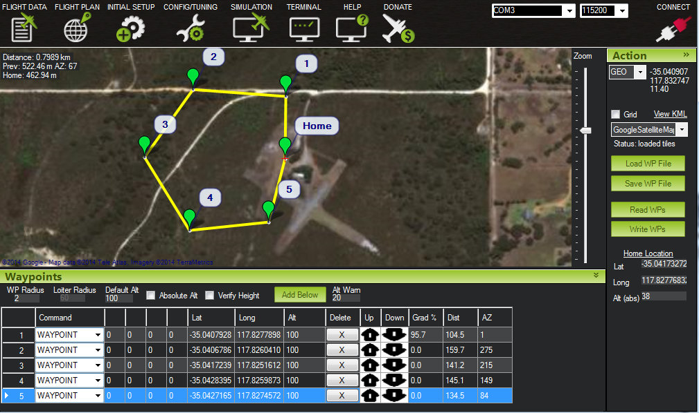
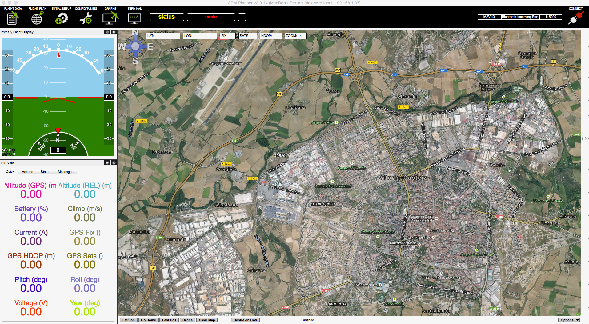
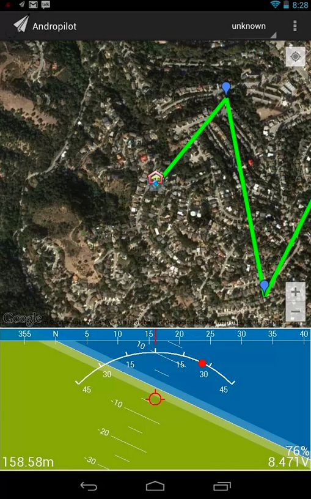
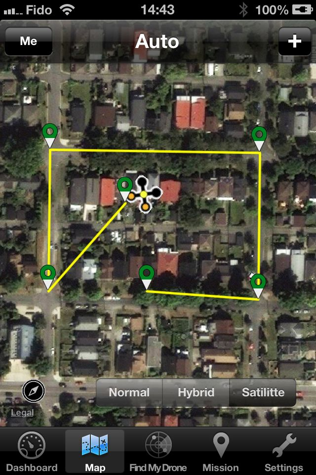
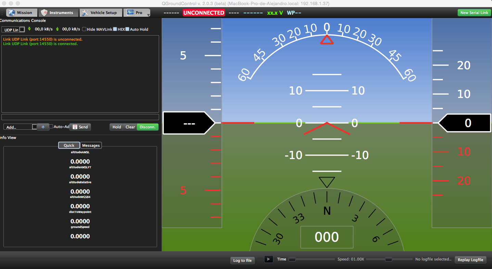

# Eligiendo una estación de control en tierra

Hay al menos 7 estaciones de control en tierra diferentes (Mission Planner, APM Planner2, MAVProxy, DroidPlanner, AndroPilot, MAVPilot and QGroundControl) que se pueden utilizar para comunicarte con ArduPilot (es decir, ArduCopter, ArduPlane y ArduRover) Esta página hace un revisión general y proporciona enlaces para que tomes la elección más apropiada.

#### [Mission Planner](http://planner.ardupilot.com/)

[Código fuente](https://github.com/diydrones/MissionPlanner)

#### [APM Planner 2](http://dev.ardupilot.com/)

[Código fuente](https://github.com/diydrones/apm_planner)

#### [MAVProxy](http://tridge.github.io/MAVProxy/)

MAVProxy es una estación de control en tierra para UAV con total funcionalidad. La intención es ser minimalista, portable y estensible para soporta cualquier protocolo MAVLink (como APM).

[Código fuente](https://github.com/tridge/MAVProxy)

#### [DroidPlanner](https://play.google.com/store/apps/details?id=org.droidplanner&hl=es)

DroidPlanner es una estación de control en tierra para Android que ejecuten el software de Ardupilot.

[Código fuente](https://github.com/DroidPlanner/droidplanner)

#### [AndroPilot](https://github.com/geeksville/arduleader/wiki)

[Código fuente](https://github.com/geeksville/arduleader/tree/master/andropilot)

#### [MAVPilot for iPhone](https://itunes.apple.com/app/mav-pilot/id649233096)

Estación de control en tierra para el bolsillo. Su público objetivo son los usuarios de iPhone (la versión para iPad llegará mas tarde). Los pilotos vuelen a menudo solos y esto puede hacer dificil el uso de un ordenador portatil al mismo tiempo. Esto es más complicado cuando el piloto un modo semi-automático como *ALT_HOLD*. Usando el iPhone en lugar de un portátil es una gran manera de mantener la concentración en la MAC y aún así tener toda la información útil es su alcance. Con apoyo integrado de voz le hará saber al instante el estado de su MAV.

[Wiki](http://diydrones.com/profiles/blogs/mav-pilot-v1-0-for-iphone-is-available-in-the-app-store)

#### [QGroundControl](http://www.qgroundcontrol.org/)

[QGroundControl](http://www.qgroundcontrol.org/) esta basado en la estación de control de PIXHAWK y ahora esta siendo desarrollado por el esfuerzo de la comunidad.

El protocolo principal de GroundControl es **MAVLink**, binario, protocolo serie que permite recibir a través de UDP o un enlace serie. La documentación completa se puede encontrar en: [MAVLink Micro Air Vehicle Communication Protocol](http://www.qgroundcontrol.org/mavlink/start).

[Código fuente]()
