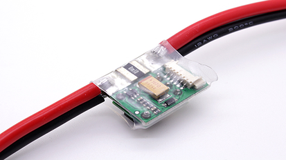
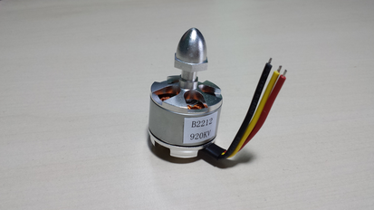

# Componentes requeridos

###Qué es lo que necesitas

#####Baterias LiPo y un cargador

Erle-Copter requiere una bateria de lítio y polímero (LiPo). Una buena regla en general es utilizar 1000 mAh (miliamperios hora) por motor. Para un quadricóptero, una bateria de 4000 mAh funcionaría bien. Tu quadricóptero solo permite utilizar una bateria al mismo tiempo, pero es recomendable tener al menos dos baterias en *stock*, más baterias significa más tiempo de vuelo. También necesitarás un cargador de baterías.

#####Un autopiloto con un módulo GPS

El autopiloto de tu multicóptero determina la capacidad para valor de forma autónoma.

#####Un transmisor y un receptor de radiocontrol de 6+ canales

Necesitarás un radiocontrol para controlar manualmente el multicóptero y para activar sus modos automáticos. Puedes usar cualquier sistema radio control transmisor/receptor con al menos 6 canales.

#####Un programa de control en tierra

Configurar misiones es sencillo con una estación de control en tierra. Existen opciones libre, de código abierto y compatibles con APM:Copter. Necesitas instalar [Mission Planner](http://planner.ardupilot.com/), [QGroundStation](http://www.qgroundcontrol.org/) o cualquier otra estación de control en tierra. Utilizar una estación de control en tierra permite cambiar facilmente los parámetros de un misión rápido y sencillo, recomendamos selecionar un portatil o una tableta como tu estación de control en tierra.

#####Bastidor de un multicóptero incluyendo motores, ESCs y hélices.

- [**Power module**](https://erlerobotics.com/blog/product/power_mod/): El *power module* incorporta tanto una manera de alimentar tu autopiloto, accesorios e informar del voltaje e intensidad de la bateria a la PXF. Todo a tavés de un solo cable incluido de 6 pines que encaja perfectamente con el conector de la PXF. El regulador tiene un salida de 5,3 voltios como máximo con un máximo de 2,25 amperios. La entrada puede establecerse hasta 18 voltios (4S LiPo) y un máximo de 90 amperios. El módulo de alimetanción está listo para conectarse como un conecto XT60.

- [**ESC**](https://erlerobotics.com/blog/product/electronic_speed_controller/): En controlador electrónico de velocidad o ESC es un circuito eléctrico con el propósito de variar la velocidad de un servo motor. Los ESCs se utilizan normalmente en motores para proporcionar un corriente trifásica de bajo voltaje y que proporciona la energía al motor. También permite la variación mucho más suave y más precisa de la velocidad del motor de una manera mucho más eficiente que los de tipo mecánico.

- [**Brushless motors**](https://erlerobotics.com/blog/product/motors/): Los motores DC eléctricos sin escobillas son conocidos como motores conmutados electricamente (ECMs, motor EC) sin motores síncronos que utilizan una fuente eléctrica de un fuente de contínua que a través de un inversor produce una señal AC to controlar el motor. Sensores adicionales y la electrónica de control invierte la amplitud y forma de onda de la salida (y por lo tanto el porcentaje de uso del bus) y la frecuencia (es decir, la velocidad de giro).

- [**Propellers**](https://erlerobotics.com/blog/product/propellers-10x4-5-ccw/): Las hélices convierten el movimiento de rotación de un pistón, turbo-propulsores o motores elécticos (nuestro caso) para proporcionar fuera de propulsión. Pueden ser fijos o de paso variable, pero nuestros multicópteros utilizan el tipo fijo. Las primeras hélices de aviones se construían en madera maciza o laminada, posteriormente se realizarían con metal. La mayoría de los diseños modernos utilizan materiales compuestos de alta tecnología.

